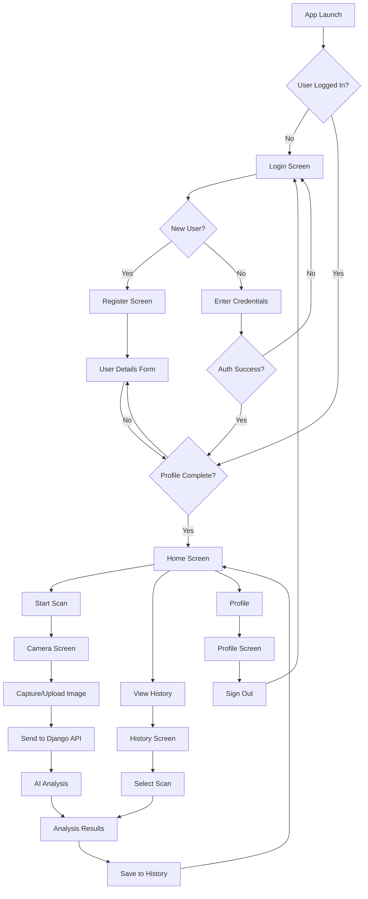
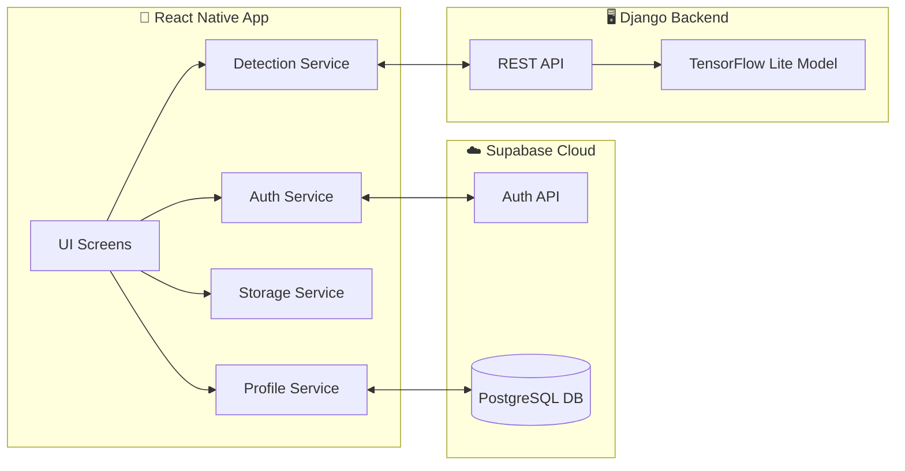

# HealthHack - Oral Health AI Detection & Monitoring 🦷

HealthHack is a premium React Native application designed for the early detection and monitoring of oral health issues using AI image analysis. It empowers users to take control of their oral health through quick screenings, educational resources, and secure health tracking.

## ✨ Key Features

- **🚀 AI-Powered Scanning**: Capture or upload images of concerning oral lesions for instant AI-based risk assessment using TensorFlow Lite.
- **📊 Medical Analysis**: Detailed diagnostic reports including risk levels, confidence scores, and key findings.
- **📋 Scan History**: Maintain a secure, searchable archive of all past assessments to track changes over time.
- **📚 Learning Center**: Comprehensive educational resources on oral health, risk factors, and preventive care.
- **🔐 Secure Authentication**: User login/registration powered by Supabase with session management.
- **👤 User Profiles**: Personalized experience with user details form, medical conditions tracking, and profile management.
- **🎨 Premium UI**: Modern, high-performance design with fluid gradients, glassmorphism, and dynamic safe-area handling.
- **🔒 Privacy First**: All scan data is stored locally on the device, ensuring maximum user privacy.

## 🛠️ Tech Stack

### Mobile App (React Native)
- **Framework**: [React Native](https://reactnative.dev/) with [Expo](https://expo.dev/)
- **Navigation**: [React Navigation](https://reactnavigation.org/) (Stack & Bottom Tabs)
- **Authentication**: [Supabase Auth](https://supabase.com/auth) with email/password
- **Database**: [Supabase](https://supabase.com/) (PostgreSQL) for user profiles
- **Icons**: [Ionicons](https://ionic.io/ionicons) & [@expo/vector-icons](https://icons.expo.fyi/)
- **Styling**: Vanilla StyleSheet with a custom Design System (theme.js)
- **State/Storage**: [AsyncStorage](https://react-native-async-storage.github.io/async-storage/) for local scan history
- **Safe Area**: [React Native Safe Area Context](https://github.com/th3rdwave/react-native-safe-area-context) for modern device support

### Backend (Django)
- **Framework**: [Django](https://www.djangoproject.com/) 6.0 with [Django REST Framework](https://www.django-rest-framework.org/)
- **AI Model**: TensorFlow Lite (oral_segmentation_quantized.tflite)
- **Database**: PostgreSQL (Supabase-hosted)
- **Authentication**: Supabase JWT verification
- **CORS**: django-cors-headers for cross-origin requests

## 📂 Project Structure

```text
HealthHack/
├── src/
│   ├── components/         # Reusable UI components (Button, ScanCard, Header)
│   ├── navigation/         # Navigation configuration (AppNavigator with auth flow)
│   ├── screens/            # Main app screens
│   │   ├── HomeScreen.js           # Dashboard with user greeting
│   │   ├── CameraScreen.js         # Image capture for AI analysis
│   │   ├── AnalysisScreen.js       # AI detection results
│   │   ├── HistoryScreen.js        # Scan history with search/filter
│   │   ├── EducationScreen.js      # Learning center
│   │   ├── ProfileScreen.js        # User profile with stats
│   │   ├── LoginScreen.js          # Authentication
│   │   ├── RegisterScreen.js       # New user registration
│   │   └── UserDetailsScreen.js    # Profile setup form
│   ├── services/           # Business logic
│   │   ├── authService.js          # Supabase authentication
│   │   ├── profileService.js       # User profile CRUD
│   │   ├── storageService.js       # Local scan storage
│   │   ├── djangoDetectionService.js # AI backend communication
│   │   └── supabaseClient.js       # Supabase client config
│   ├── styles/             # Global theme and design tokens
│   └── utils/              # Constants and helper functions
├── django_backend/         # Python AI backend
│   ├── config/             # Django settings
│   ├── detector/           # AI detection API
│   ├── ml_model/           # TensorFlow Lite model
│   └── requirements.txt    # Python dependencies
├── App.js                  # Application entry point
├── app.json                # Expo configuration
└── package.json            # Dependencies and scripts
```

## 🔄 App Flow Diagram



## 🏗️ System Architecture




## 🚀 Installation Guide for Windows Users

> **Don't worry if you're new to coding!** Just follow these steps carefully, one at a time. ⏱️ Total setup time: 30-45 minutes

---

## 📋 Part 1: Download Required Software (One-Time Setup)

### Step 1: Install Node.js

**What is Node.js?** It's the software that runs JavaScript code on your computer.

1. Go to [https://nodejs.org/](https://nodejs.org/)
2. Click the **green button** that says "Download Node.js (LTS)"
3. Once downloaded, **double-click** the installer file
4. Click **Next → Next → Next → Install** (keep all default settings)
5. Wait for installation to complete, then click **Finish**

**✅ Verify it worked:**
- Press `Windows Key + R`
- Type `cmd` and press Enter
- In the black window, type: `node --version`
- You should see something like `v20.11.0`

---

### Step 2: Install Python

**What is Python?** It's needed to run the AI analysis part of the app.

1. Go to [https://www.python.org/downloads/](https://www.python.org/downloads/)
2. Click **Download Python 3.12.x** (or latest version)
3. **IMPORTANT:** When the installer opens, **CHECK the box** that says "Add Python to PATH"
4. Click **Install Now**
5. Wait for installation, then click **Close**

**✅ Verify it worked:**
- Open Command Prompt (Windows Key + R, type `cmd`, press Enter)
- Type: `python --version`
- You should see something like `Python 3.12.1`

---

### Step 3: Install Git (Optional but Recommended)

**What is Git?** It helps you download the project code.

1. Go to [https://git-scm.com/download/win](https://git-scm.com/download/win)
2. Download will start automatically
3. Run the installer
4. Click **Next** through all screens (default settings are fine)
5. Click **Install**, then **Finish**

---

### Step 4: Set Up Android Testing

**Choose ONE option:**

#### Option A: Use Your Android Phone (Easier! ✨ Recommended)

1. On your phone, open **Google Play Store**
2. Search for **"Expo Go"**
3. Install the app
4. Make sure your phone is connected to the **same WiFi** as your computer
5. That's it! You'll use this later.

#### Option B: Use Android Emulator (More Setup Required)

1. Download **Android Studio** from [https://developer.android.com/studio](https://developer.android.com/studio)
2. Install it (this takes 10-15 minutes)
3. Open Android Studio
4. Click **More Actions → Virtual Device Manager**
5. Click **Create Device → Pixel 5 → Next**
6. Download a system image (click Download next to "S" or "Tiramisu")
7. Click **Next → Finish**

---

## 📥 Part 2: Download and Set Up the Project

### Step 5: Download the Project

**If you installed Git:**
1. Right-click on your Desktop
2. Select **"Git Bash Here"**
3. Type this and press Enter:
   ```bash
   git clone https://github.com/yourusername/HealthHack.git
   ```

**If you didn't install Git:**
1. Download the project as a ZIP file from GitHub
2. Right-click the ZIP file → **Extract All**
3. Extract to your Desktop

---

### Step 6: Open the Project Folder

1. Press `Windows Key + R`
2. Type `cmd` and press Enter
3. Type these commands one by one (press Enter after each):
   ```bash
   cd Desktop\HealthHack-main
   ```

**💡 Tip:** If you extracted to a different location, replace `Desktop\HealthHack-main` with your actual path.

---

### Step 7: Install App Dependencies

**What are dependencies?** Think of them as all the building blocks the app needs to work.

In the Command Prompt window, type:
```bash
npm install
```

**⏱️ This will take 5-10 minutes.** You'll see lots of text scrolling. That's normal!

**✅ When done:** You'll see a message like "added 1234 packages"

---

## 🤖 Part 3: Set Up the AI Backend

### Step 8: Set Up Python Environment

1. In the same Command Prompt, type:
   ```bash
   cd django_backend
   ```

2. Create a virtual environment (a separate space for Python packages):
   ```bash
   python -m venv venv
   ```

3. Activate it:
   ```bash
   venv\Scripts\activate
   ```

**✅ You'll see `(venv)` appear at the start of your command line**

---

### Step 9: Install AI Dependencies

Type this command:
```bash
pip install -r requirements.txt
```

**⏱️ This takes 3-5 minutes.** You'll see packages being downloaded and installed.

---

### Step 10: Find Your Computer's IP Address

**Why?** Your phone needs to know where to find your computer on the WiFi network.

1. Open a **new** Command Prompt window (keep the other one open!)
2. Type: `ipconfig`
3. Look for **"IPv4 Address"** under your WiFi adapter
4. It will look like: `192.168.1.100` or `172.25.244.109`
5. **Write this number down!** You'll need it in the next steps.

**💡 Example:**
```
Wireless LAN adapter Wi-Fi:
   IPv4 Address. . . . . . . . . . . : 192.168.1.100  ← THIS NUMBER!
```

---

### Step 11: Configure the Backend

1. In the `django_backend` folder, find the file named `.env.example`
2. Right-click it → **Open with → Notepad**
3. Change this line:
   ```
   ALLOWED_HOSTS=localhost,127.0.0.1,YOUR_IP_ADDRESS
   ```
   To (using YOUR IP from Step 10):
   ```
   ALLOWED_HOSTS=localhost,127.0.0.1,192.168.1.100
   ```

4. Change this line:
   ```
   CORS_ALLOWED_ORIGINS=http://localhost:8000,http://YOUR_IP_ADDRESS:8081
   ```
   To:
   ```
   CORS_ALLOWED_ORIGINS=http://localhost:8000,http://192.168.1.100:8081
   ```

5. Click **File → Save As**
6. Change the filename from `.env.example` to `.env`
7. Make sure "Save as type" is set to **"All Files"**
8. Click **Save**

---

### Step 12: Set Up the Database

In your Command Prompt (the one with `(venv)` showing), type:
```bash
python manage.py migrate
```

**✅ You'll see:** "Applying migrations... OK"

---

### Step 13: Start the AI Server

Type this command:
```bash
python manage.py runserver 0.0.0.0:8000
```

**✅ Success looks like:**
```
Starting development server at http://0.0.0.0:8000/
Quit the server with CTRL-BREAK.
```

**🎉 Great! The AI server is running!** 

**⚠️ IMPORTANT: Keep this window open!** Don't close it or the AI won't work.

---

## 📱 Part 4: Set Up and Run the Mobile App

### Step 14: Configure the App to Find Your AI Server

1. Open the project folder in File Explorer
2. Navigate to: `src → services`
3. Find the file: `djangoDetectionService.js`
4. Right-click → **Open with → Notepad**
5. Find line 5 (near the top):
   ```javascript
   const DJANGO_BASE_URL = 'http://172.25.244.109:8000';
   ```
6. Change it to YOUR IP address from Step 10:
   ```javascript
   const DJANGO_BASE_URL = 'http://192.168.1.100:8000';
   ```
7. Click **File → Save**

---

### Step 15: Start the Mobile App

1. Open a **NEW** Command Prompt window (keep the AI server running!)
2. Navigate to the project:
   ```bash
   cd Desktop\HealthHack-main
   ```
3. Start the app:
   ```bash
   npx expo start
   ```

**⏱️ Wait 30-60 seconds.** You'll see a QR code appear!

---

### Step 16: Open the App on Your Phone

**If using your phone (Option A from Step 4):**

1. Open the **Expo Go** app on your phone
2. Tap **"Scan QR Code"**
3. Point your camera at the QR code in the Command Prompt
4. The app will load! (Takes 30-60 seconds first time)

**If using Android Emulator (Option B from Step 4):**

1. Open Android Studio
2. Click the **green play button** next to your virtual device
3. Wait for the emulator to start (takes 1-2 minutes)
4. In the Command Prompt where you ran `npx expo start`, press the **`a`** key
5. The app will install and open automatically

---

## 🎉 You're Done! Testing the App

1. The app should open on your phone/emulator
2. You'll see the **Home Screen**
3. Tap the **Camera button**
4. Take a photo or select one from your gallery
5. Wait a few seconds for AI analysis
6. See your results!

---

## 🔄 How to Use It Again Tomorrow

**You don't need to reinstall everything!** Just do this:

### Quick Start (2 steps):

**Step 1: Start the AI Server**
```bash
cd Desktop\HealthHack-main\django_backend
venv\Scripts\activate
python manage.py runserver 0.0.0.0:8000
```

**Step 2: Start the App (in a new Command Prompt)**
```bash
cd Desktop\HealthHack-main
npx expo start
```

Then open on your phone using Expo Go!

---

## ❓ Common Problems and Fixes

### Problem 1: "Cannot connect to Django server"

**Fix:**
- Make sure the AI server is running (you should see "Starting development server...")
- Check that both Command Prompt windows are still open
- Make sure your phone and computer are on the same WiFi

### Problem 2: "Port 8000 is already in use"

**Fix:**
1. Close all Command Prompt windows
2. Press `Ctrl+Alt+Delete` → **Task Manager**
3. Find "Python" in the list → Right-click → **End Task**
4. Try starting the server again

### Problem 3: "Module not found" or weird errors

**Fix:**
```bash
cd Desktop\HealthHack-main
rmdir /s node_modules
npm install
```

### Problem 4: App won't load on phone

**Fix:**
- Make sure you're on the same WiFi network
- Try closing and reopening Expo Go app
- Restart your phone
- In Command Prompt, press `r` to reload

### Problem 5: "Python is not recognized"

**Fix:**
- You forgot to check "Add Python to PATH" during installation
- Uninstall Python and reinstall it, making sure to check that box!

---

## 🆘 Still Stuck?

If something isn't working:

1. **Close everything** (all Command Prompt windows)
2. **Restart your computer**
3. Follow the "Quick Start" steps again
4. If still not working, check that:
   - Your IP address hasn't changed (run `ipconfig` again)
   - Your firewall isn't blocking port 8000
   - You're using the same WiFi on phone and computer

---

## � Need More Help?

- Check the error message carefully
- Google the exact error message
- Make sure you followed each step exactly
- Try the "Common Problems" section above

**Remember:** The first time is always the hardest! Once it's set up, it's much easier to use. 

## ⚠️ Medical Disclaimer

**IMPORTANT: This application is for informational and educational purposes only.**
The AI-generated analysis is NOT a professional medical diagnosis. Users should always consult with a qualified dentist, oncologist, or healthcare professional for any concerning lesions or medical questions. Never disregard professional medical advice or delay seeking it because of something you have read or analyzed within this app.

## 🎨 Design System

The app follows a strict **Premium Medical Design System**:
- **Palette**: Deep Trust Blues (`#0F62FE`), Modern Teals, and high-contrast risk indicators.
- **Typography**: Clean system fonts with weighted hierarchy.
- **Feedback**: Dynamic transition animations and haptic-style button states.

---
Built with ❤️ for better Oral Health in 2026.
