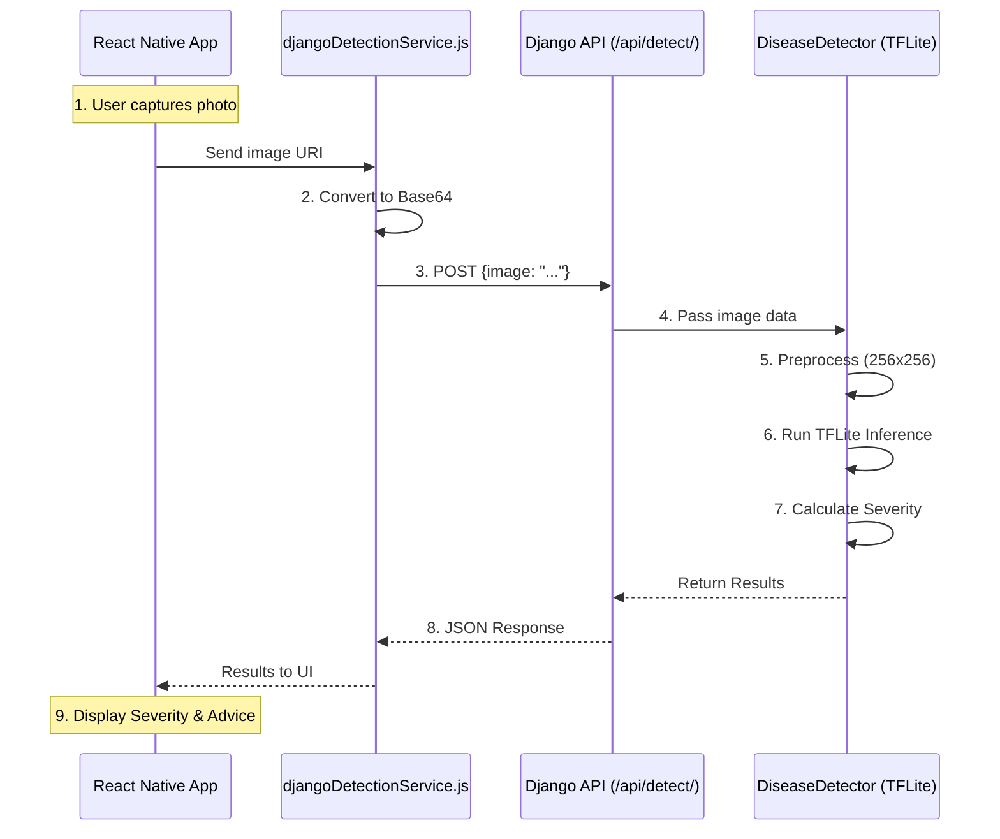

# HealthHack API Endpoints & System Flow

This document details the communication between the React Native frontend and the Django backend, including endpoint specifications and data flow.

## 📡 API Endpoints

### 1. Health Check
Used by the frontend to verify the backend server is reachable.

- **URL**: `/api/health/`
- **Method**: `GET`
- **Response**: `200 OK`
- **Body**:
```json
{
  "status": "ok"
}
```

### 2. Disease Detection
The primary endpoint for processing images and returning analysis.

- **URL**: `/api/detect/`
- **Method**: `POST`
- **Request Body**:
```json
{
  "image": "base64_encoded_string"
}
```
- **Response**: `200 OK`
- **Body**:
```json
{
  "diseasePercentage": 15.5,
  "severityLevel": "MODERATE",
  "hasDiseaseDetected": true,
  "confidence": 0.155,
  "thresholdUsed": 0.5
}
```

## � File Connections

This section maps the API components to their respective source files in the codebase.

### Frontend (React Native)
| Component | File Path | Responsibility |
|-----------|-----------|----------------|
| **Trigger** | [CameraScreen.js](file:///e:/HealthHack-main%20(1)/HealthHack-main/src/screens/CameraScreen.js) | UI for photo capture/selection and calling the API service. |
| **API Client** | [djangoDetectionService.js](file:///e:/HealthHack-main%20(1)/HealthHack-main/src/services/djangoDetectionService.js) | Handles HTTP requests, Base64 conversion, and error management. |
| **Constants** | [constants.js](file:///e:/HealthHack-main%20(1)/HealthHack-main/src/utils/constants.js) | Stores API URLs and base configurations. |

### Backend (Django)
| Component | File Path | Responsibility |
|-----------|-----------|----------------|
| **Routing** | [urls.py](file:///e:/HealthHack-main%20(1)/HealthHack-main/django_backend/config/urls.py) | Maps the `/api/*` paths to the correct views. |
| **View/Controller** | [views.py](file:///e:/HealthHack-main%20(1)/HealthHack-main/django_backend/detector/views.py) | Validates incoming requests and coordinates the detection flow. |
| **Core Service** | [detector_service.py](file:///e:/HealthHack-main%20(1)/HealthHack-main/django_backend/detector/detector_service.py) | Wraps the TFLite model, handles image processing, and runs inference. |
| **Configuration** | [settings.py](file:///e:/HealthHack-main%20(1)/HealthHack-main/django_backend/config/settings.py) | Defines the `MODEL_PATH` and security settings (CORS, ALLOWED_HOSTS). |

## �🔄 Backend to Frontend Flow

The system follows a linear request-response pattern to provide real-time feedback to the user.



### Flow Breakdown

1.  **Image Capture**: User takes a photo or selects one from the gallery in the `CameraScreen`.
2.  **Base64 Encoding**: The `djangoDetectionService` converts the image file into a Base64 string to ensure safe transmission over HTTP.
3.  **API Request**: The app sends an asynchronous `POST` request to the Django backend.
4.  **Backend Processing**:
    *   API receives the JSON payload.
    *   The `DiseaseDetector` service decodes the image.
    *   The image is resized and normalized for the AI model.
    *   The TFLite model runs inference.
    *   Metrics like disease percentage and severity level are calculated.
5.  **JSON Response**: The backend returns a structured JSON object containing all analysis metrics.
6.  **UI Update**: The frontend receives the results and updates the `AnalysisScreen` with the severity level and corresponding health recommendations.
